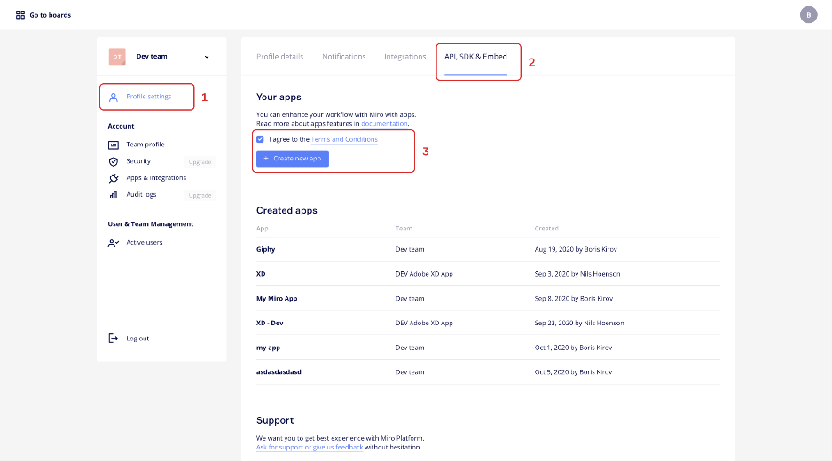
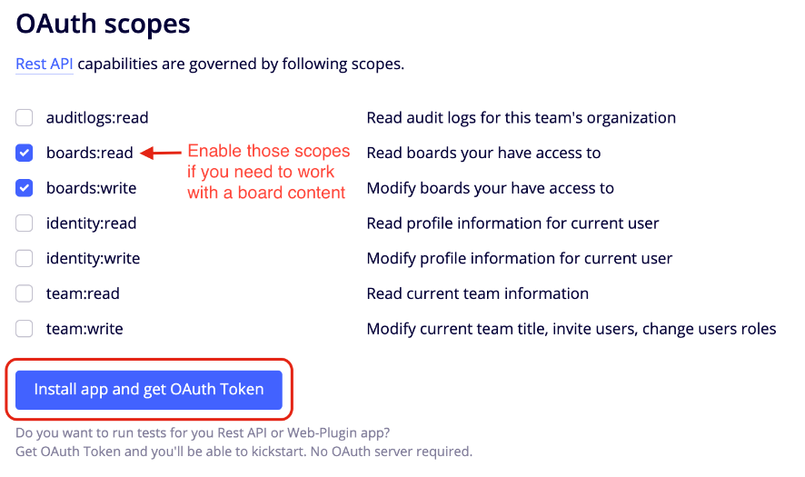

# miro2cml "Whiteboard to Model Compiler"

miro2cml is a compiler that generates a [Context Mapper](https://contextmapper.org/) file from a [Miro](https://miro.com/) board. miro2cml expects a specific Miro board template so that it can export the board in a meaningful way. miro2cml supports the following three Templates: [The User Story Map](https://miro.com/templates/user-story-map/), [The Bounded Context Canvas](https://github.com/ddd-crew/bounded-context-canvas) and [Event Storming](https://contextmapper.org/img/lakeside-mutual-event-storming-result.jpg).

This Readme describes the installation of the application miro2cml. The tutorials and mapping heuristics are included in the application.

miro2cml is based on a Student Research Project by Timothée Moos and Saskia Stillhart.

# Overview

miro2cml consists of the following components:

- Web Interface - the graphical user interface which also contains the tutorials and mapping heuristics (based on [Thymeleaf](https://www.thymeleaf.org/)) 
  - Tutorials - for each Template detailed instructions on how to create the Miro Board, how to convert it and how to continue using the Context Mapper File 
  - Mapping Heuristics/Tables - for each Template
- Compiler - the RESTful HTTP API which represents the core of the application (based on [Spring Boot](https://spring.io/projects/spring-boot))

# Installation

Prerequisite: Java Version 11

The miro2cml application can be started by several means. These would be: Using a StartScript, starting via a Terminal/Command Line Interface or via Docker. For the sake of simplicity, it is assumed here that the application is started on the same machine on which it is to be used.

In addition to the installation, the Miro App must be configured.

### Starter Script (recommended)

In the root directory of the source code there are two starter scripts, one startMiro2cml.sh for Ubuntu and one startMiro2cml.bat for Windows.

When the script is executed, the application is first built and then executed. The script can be started from the command line as well as from the graphical interface of the operating system.

1. navigate to the root directory of the source code
2. activate starter script (Linux: startMiro2cml.sh, Windows: startMiro2cml.bat)
3. start browser and visit http://localhost:8080

(On Linux, you may need to set the appropriate execution permissions first):

```
chmod +x gradlew

chmod +x startMiro2cml.sh
```

### Command Line Interface

1. navigate to the root directory of the source code

2. Type the following command: 

   ```
   gradlew bootJar
   ```

3. Type the following command: 

   Windows: 

   ```
   java -jar build\libs\miro2cml-0.3.0-SNAPSHOT.jar
   ```

   Ubuntu: 

   ```
   java -jar build/libs/miro2cml-0.3.0-SNAPSHOT.jar
   ```

4. start browser and visit http://localhost:8080

(On Linux, you may need to set the appropriate execution permissions first):

```
chmod +x gradlew

chmod +x startMiro2cml.sh
```

### Docker (only Tested on Ubuntu/Debian):

1. navigate to the root directory of the source code

2. Type the following commands: 

   ```
   chmod +x gradlew
   ```

   ```
   gradlew bootJar
   ```

3. ```
   docker build -t miro2cml/local-snapshot .
   ```

4. ```
   docker run -p 8080:8080 miro2cml/local-snapshot
   ```

5. start browser and visit http://localhost:8080

With Docker it is very easy to reconfigure the listening port of the application, just replace the argument {-p 8080:8080} with the argument {-p [port]:8080} in the docker run command.

### Miro App Configuration:

1. Create app at: https://miro.com/app/settings/user-profile/apps A simple widget will open, allowing you to specify the name and a description. After that, you will be automatically redirected to the app's settings window.
2. Define Redirect URLs: In this settings menu, you can enter new URLs in the Redirect URLs section.
3. Set scopes: Now you have to set the permissions: 

4. Insert Client ID & Secret in application.properties: At the top of the settings menu you will find the client ID and the client secret, these must be inserted into the file src/main/resources/application.properties corresponding to the key miro.client.id and miro.client.secret.

You can find more information on: https://developers.miro.com/docs/getting-started

# Knowing Limitations

- Missing Feature: copy to clipboard button
- User Stories Template: does not support the two keywords *with its* and *for a*. [Link to Context Mapper Documentation](https://contextmapper.org/docs/user-requirements/)

#  Licence

All source code ist released under the [Apache License, Version 2.0](http://www.apache.org/licenses/LICENSE-2.0).